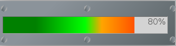

# :neckbeard: VuMeter



VuMeter is a lightweight front web component highly customizable.

Here you will find the api to display a vu-meter throught different styles and directions.  

No graphical assets required nor external dependencies, just 30 lines of js and a bunch of css.

## Sample code  
``` html
 <div class="board gradientmetal">
    <div class="screwgridh">
        <div class="screwbox">
            <div class="hexagon screwcenter"></div>
        </div>
        <div class="screwbox">
            <div class="hexagon screwcenter"></div>
        </div>
        <div class="screwbox">
            <div class="hexagon screwcenter"></div>
        </div>
    </div>
    <div id="vumhboarded1" class="vum vumh gradienthdefault">
        <div class="vumoverlay vumoverlayh" data-tooltip=""></div>
    </div>
    <div class="screwgridh">
        <div class="screwbox">
            <div class="hexagon screwcenter"></div>
        </div>
        <div class="screwbox">
            <div class="hexagon screwcenter"></div>
        </div>
        <div class="screwbox">
            <div class="hexagon screwcenter"></div>
        </div>
    </div>
</div>
```