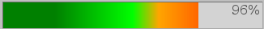
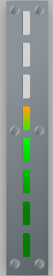

# :neckbeard: VuMeter demo

VuMeter is a lightweight animated front web component highly customizable.

Here you will find the api to display a vu-meter throught different styles and directions.  

No assets required nor external dependencies, just 30 lines of procedural vanilla js and a bunch of css.

## Demo

### Raw



``` html
<div id="vumhboarded1" class="vum vumh gradienthdefault">
    <div class="vumoverlay vumoverlayh" data-tooltip=""></div>
</div>
```

### Boarded

#### Horizontal


``` html
 <div class="board gradientmetal">
    <div class="screwgridh">
        <div class="screwbox">
            <div class="hexagon screwcenter"></div>
        </div>
        <div class="screwbox">
            <div class="hexagon screwcenter"></div>
        </div>
        <div class="screwbox">
            <div class="hexagon screwcenter"></div>
        </div>
    </div>
    <div id="vumhboarded1" class="vum vumh gradienthdefault">
        <div class="vumoverlay vumoverlayh" data-tooltip=""></div>
    </div>
    <div class="screwgridh">
        <div class="screwbox">
            <div class="hexagon screwcenter"></div>
        </div>
        <div class="screwbox">
            <div class="hexagon screwcenter"></div>
        </div>
        <div class="screwbox">
            <div class="hexagon screwcenter"></div>
        </div>
    </div>
</div>
```

#### Vertical



``` html
<div class="board boardv gradientmetal">
    <div class="screwgridv">
        <div class="screwboxv">
            <div class="hexagon"></div>
        </div>
        <div class="screwboxv">
            <div class="hexagon"></div>
        </div>
        <div class="screwboxv">
            <div class="hexagon"></div>
        </div>
    </div>
    <div id="boardedv1" class="vum vumv gradientvdefault maskledv" style="width:.7em">
        <div class="vumoverlay vumoverlayv"></div>
    </div>
    <div class="screwgridv">
        <div class="screwboxv">
            <div class="hexagon"></div>
        </div>
        <div class="screwboxv">
            <div class="hexagon"></div>
        </div>
        <div class="screwboxv">
            <div class="hexagon"></div>
        </div>
    </div>
</div>
```

### Gradients

A collection of exisiting gradients can be found in [gradient.css](src/css/gradient.css).

### Masks

A collection of exisiting masks can be found in [mask.css](src/css/mask.css).

### Board

A sample board can be found in [board.css](src/css/board.css).

### Screew

A sample screew can be found in [screew.css](src/css/screew.css).

## Usage

Clone or download this repo then open [index.html](src/index.html) into your web browser.  
To package and use in your own project, peek css sheet code then include [vumeter.js](src/js/vumeter.js).

## Extra

You can also use the custom element [vu-meter](src/components/vumcomponent.ts).

``` html
<vu-meter 
    id="vu-meter" 
    direction="horizontal" 
    gradient="default" 
    value="75"
/>
```
To compile it, run tsc from command line, it will build the [vumcomponent.js](src/js/vumcomponent.js).

## Todo

### Features

* Clipping
* Svg masks
